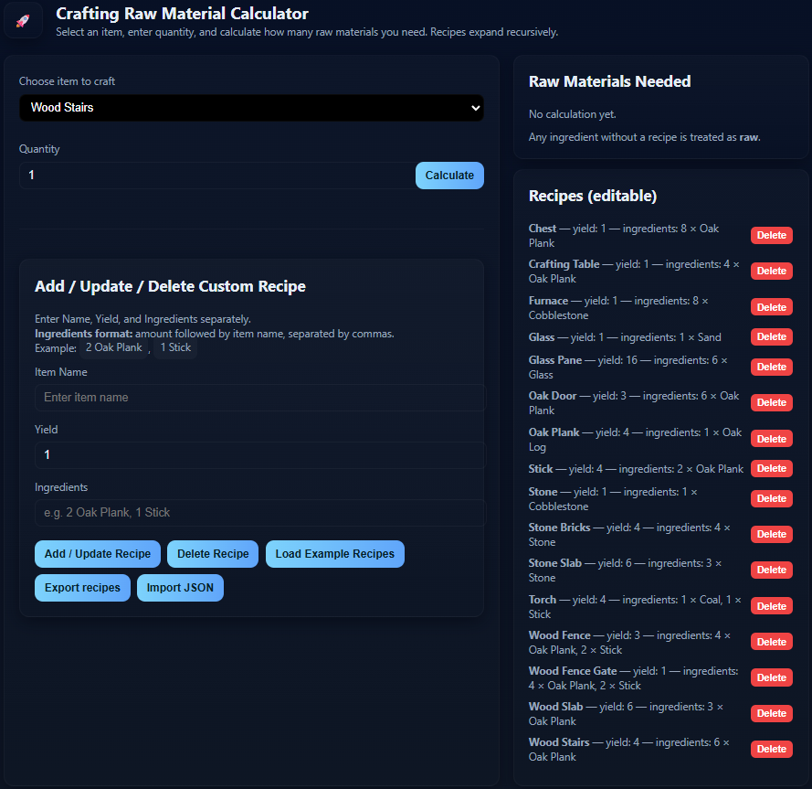

# <| _ Minecraft Tools!
### ***Welcome to the file, I am new to this whole GitHub thing so don't be mad. And the README! :)***

---
## <| _ WHAT IS Minecraft Tools:
### *Minecraft Tools* is a tool used to calculate the amount of resources you will need in order to craft a specific recipe!
#### ( *EX: [Wood Stairs](https://minecraft.wiki/w/Wooden_Stairs#Oak)* )

---

# <| _ Preview:

# <| _ [The **FUCKING** Website](https://redclaws1800.github.io/MinecraftTools/)

---

# <| _ DISCLAIMER:
## **This code is created by [GPT-5](https://openai.com/index/introducing-gpt-5)!**

---

# <| _ THINGS I WANT TO ADD:

- **Saving**
- **Better UI**
- **Color Change**
- **Other Functions**

---

## <| _ UPDATES:

- **v0.1: Uploaded on 8.21.25 to GitHub and made accessible via GitHub.**

---

### <| _ PATCHES:

***None Yet!***

---